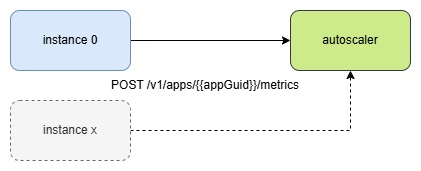

# How to Autoscale Spring Boot Application on Cloud Foundry Using Custom Metrics

A demo project showing how to autoscale a Spring Boot application on Cloud Foundry using custom metrics.

# Overview

Custom metrics scaling allows you to scale applications based on your own defined metrics that can represent job queues, 
pending tasks, etc. 

This enables you to align scaling precisely with business needs and workload patterns instead of relying solely on 
infrastructure metrics like CPU or memory usage.

This demo shows an application that is autoscaled based on custom metrics it provides to the autoscaler.



In the demo app, a custom metric called 'my_counter' is used for autoscaling. It is a simple value stored in Redis 
for the purpose of the demo, and it can be adjusted through a REST API controller.

# Requirements

Redis Service – A Redis cache service is used to share the custom metric value between application instances. 
You can adjust the metrics provider to use another service for sharing the metric value if needed.

# Concept

An Autoscaler service exposes a custom metrics URL and an endpoint for sending metrics.

The URL is defined in `VCAP_SERVICES`:

```json
{
  "autoscaler": [
    {
      "credentials": {
        "custom_metrics": {
          "mtls_url": "https://autoscaler-metrics-mtls.cf.example.org"
        }
      }
    }
  ]
}
```
and the endpoint is:

```text
  {{mtls_url}}/v1/apps/{{appGuid}}/metrics
```
where `appGuid` is you application id defined in `VCAP_APPLICATION['application_id']`

To authenticate, the app uses the X.509 certificate and private key provided in the environment 
variables `CF_INSTANCE_CERT` and `CF_INSTANCE_KEY`.

The custom metrics payload in our case is:

```json
{
  "instance_index": "{{instance_index}}",
  "metrics": [
    {
      "name":"my_counter",
      "value": 7
    }
  ]
} 
```

where `instance_index` is available in the environment variable `CF_INSTANCE_INDEX`.

# Launching the Demo Application

This application was tested on SAP BTP. You may need to adjust the application or the instructions depending on 
your specific CF environment.

CD to root project directory.

Set CF api and login to CF:

```shell
cf api https://your-cf-api-url.example.org
cf login
```

Create Redis service:
```shell
cf create-service redis-cache trial redis
```

Create Autoscaler service
```shell
cf create-service autoscaler standard autoscaler
```

Install an Autoscaler plugin, and set autoscaler endpoint
```shell
cf install-plugin -r CF-Community app-autoscaler-plugin
cf cf autoscaling-api https://autoscaler.<your-domain-cf-domain>
```

Build and push application using `manifest.yml` file.
```shell
mvn clean package
cf push --no-start
```

Attach and check the autoscaler policy.
```shell
cf attach-autoscaling-policy cfasdemo autoscaling-policy.json
cf autoscaling-policy cfasdemo
```

Check VCAP_SERVICE environment:
```shell
cf env cfasdemo
```

Start the `cfasdemo` application.
```shell
cf start cfasdemo
```

Check and increase `my_counter` value. You can use curl or [`requests.http`](./src/test/resources/requests.http)
`my_counter` value is cached for an hour.
```shell
# get current value
curl https://your-app-url.cf.example.org/api/cache/my_counter
# set value
curl -X PUT https://your-app-url.cf.example.org/api/cache/my_counter/11
```
The custom `my_counter` value is emitted every 30 seconds, and the autoscaler threshold is set to 60 seconds. 
After adjusting `my_counter` to a value greater than or equal to 10, you can expect the application to autoscale 
within a few minutes.


After a couple of minutes, check metrics:
```shell
cf autoscaling-metrics cfasdemo my_counter
```

and after some time check autoscaling history
```shell
cf autoscaling-history cfasdemo
```
